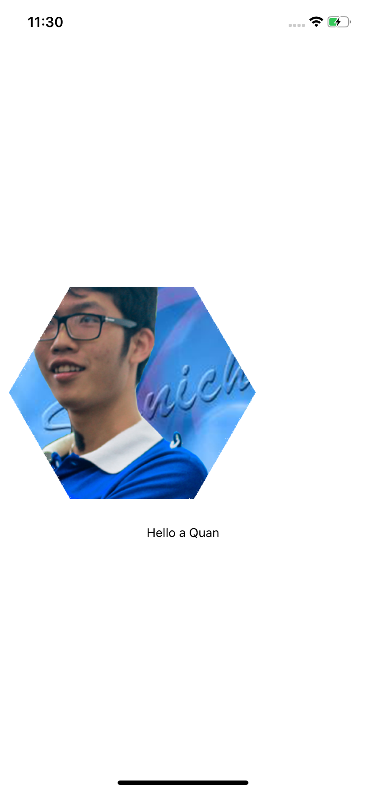

# react-native-avatar-hexagon

not desription

## Installation

```sh
yarn add react-native-avatar-hexagon
```
```sh
cd ios && pod install
```



## Usage

```js
import React from 'react';
import {SafeAreaView, Text} from 'react-native';

import AvatarHexagon from 'react-native-avatar-hexagon';

export default function () {
    console.log(AvatarHexagon);
    return <SafeAreaView style={{flex: 1, justifyContent: 'center'}}>
        <AvatarHexagon style={{width: 300, height: 300}}
                       imgUrl={'https://avatars0.githubusercontent.com/u/3259822?s=460&u=33640aef0a3f16ec53b1c460230dfea716c0b24f&v=4'}
                       maskUrl={'https://i.imgur.com/FuMhbzm.png'}
        />
        <Text style={{textAlign: 'center'}}>
            Hello a Quan
        </Text>
    </SafeAreaView>;
}

```
